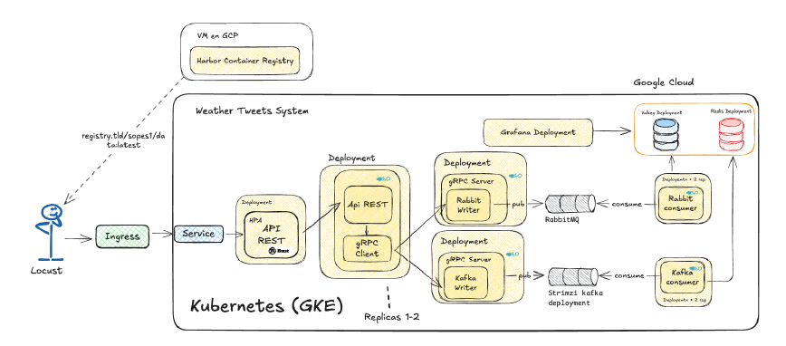

# Plataforma de Streaming de Datos Meteorológicos

Plataforma distribuida basada en microservicios para la ingestión, procesamiento y distribución en tiempo real de datos meteorológicos. El sistema recibe eventos climáticos vía HTTP, los publica en dos brokers de mensajería en paralelo (Kafka y RabbitMQ), los persiste en bases clave-valor (Redis y Valkey) y los expone en dashboards de Grafana. Toda la infraestructura está desplegada sobre Kubernetes en Google Cloud Platform (GKE).


---

## Índice

- [Descripción general](#descripción-general)
- [Arquitectura de microservicios](#arquitectura-de-microservicios)
- [Estructura del repositorio](#estructura-del-repositorio)
- [Componentes](#componentes)
- [Contrato gRPC](#contrato-grpc)
- [Infraestructura en Kubernetes](#infraestructura-en-kubernetes)
- [Despliegue en Google Cloud Platform](#despliegue-en-google-cloud-platform)
- [Flujo de datos completo](#flujo-de-datos-completo)
- [Pruebas de carga](#pruebas-de-carga)
- [Instalación y ejecución local](#instalación-y-ejecución-local)
- [Habilidades demostradas](#habilidades-demostradas)
- [Documentación adicional](#documentación-adicional)

---

## Descripción general

El proyecto implementa una arquitectura de streaming en tiempo real orientada a microservicios, donde cada capa del sistema es un servicio independiente, desplegado en su propio contenedor y comunicado mediante protocolos distintos según la necesidad: HTTP para la entrada pública, gRPC para la comunicación interna entre servicios, y mensajería asíncrona (Kafka y RabbitMQ) para el desacoplamiento entre productores y consumidores.

El sistema procesa un mismo evento climático por dos rutas de mensajería en paralelo, lo que permite comparar el comportamiento de dos tecnologías de streaming distintas (Kafka y RabbitMQ) y dos motores de almacenamiento clave-valor (Redis y Valkey) dentro de la misma plataforma.

---

## Arquitectura de microservicios

Cada componente del sistema es un microservicio independiente, con su propio ciclo de build, contenedor Docker y manifiesto de despliegue en Kubernetes. La comunicación entre servicios internos se realiza por gRPC con contratos definidos en Protocol Buffers, mientras que la entrada pública se expone mediante un Ingress HTTP.



Cada uno de los siguientes servicios corre como un Deployment independiente en el clúster, con su propio Service y, en los casos que lo requieren, su propio HorizontalPodAutoscaler:

| Servicio | Lenguaje | Rol | Comunicación |
|---|---|---|---|
| API REST | Rust | Punto de entrada público del sistema | Recibe HTTP, reenvía a Go Client |
| Go Client | Go | Coordinador interno | Recibe HTTP, invoca gRPC a los writers |
| Kafka Writer | Go | Productor gRPC hacia Kafka | Expone gRPC, publica en Kafka |
| Rabbit Writer | Go | Productor gRPC hacia RabbitMQ | Expone gRPC, publica en RabbitMQ |
| Kafka Consumer | Go | Consumidor de Kafka | Lee del topic, escribe en Redis |
| Rabbit Consumer | Go | Consumidor de RabbitMQ | Lee de la cola, escribe en Valkey |
| Redis | - | Almacenamiento clave-valor | Alimentado por Kafka Consumer |
| Valkey | - | Almacenamiento clave-valor | Alimentado por Rabbit Consumer |
| Grafana | - | Visualización | Consulta Redis y Valkey como datasources |

---

## Componentes

### API REST (Rust)

Servicio de entrada del sistema. Expone un endpoint HTTP que recibe peticiones POST con un JSON de clima (`description`, `country`, `weather`) y las reenvía al Go Client. Está desplegado con réplicas gestionadas por un HorizontalPodAutoscaler que escala según uso de CPU.

### Go Client

Servicio de coordinación entre la API pública y los sistemas de mensajería. Recibe el evento vía HTTP, construye la petición gRPC correspondiente y la envía tanto al Kafka Writer como al Rabbit Writer, agregando ambas respuestas en un único JSON de salida.

### Kafka Writer (Go)

Servidor gRPC que implementa el método `Publish` del contrato definido en `writer.proto`. Convierte la petición recibida en JSON y la publica en el topic `clima-topic` de Kafka usando `kafka-go`. Escucha en el puerto 50052.

### Rabbit Writer (Go)

Servidor gRPC equivalente al Kafka Writer, pero orientado a RabbitMQ. Declara la cola `clima-queue`, publica el mensaje vía AMQP y responde con el resultado de la operación. Escucha en el puerto 50051.

### Kafka Consumer (Go)

Se suscribe al topic `clima-topic`, transforma cada evento recibido en un registro de almacenamiento y lo guarda en Redis. Se ejecuta con dos réplicas para procesar mensajes en paralelo.

### Rabbit Consumer (Go)

Consume mensajes de la cola `clima-queue`, los procesa de forma equivalente al consumidor de Kafka y almacena la información en Valkey.

### Redis y Valkey

Bases de datos clave-valor utilizadas como almacenamiento final. Redis recibe los datos que pasan por Kafka; Valkey recibe los datos que pasan por RabbitMQ, permitiendo comparar ambas rutas de procesamiento de forma aislada.

### Grafana

Capa de visualización del sistema. Consulta Redis y Valkey como fuentes de datos independientes y presenta el estado del clima en dashboards en tiempo real e histórico.

---

## Contrato gRPC

La comunicación interna entre el Go Client y los servicios Writer se define en `writer.proto` mediante un servicio `WriterService` con un único método RPC:

```protobuf
service WriterService {
  rpc Publish (PublishRequest) returns (PublishResponse);
}

message PublishRequest {
  string description = 1;
  string country = 2;
  string weather = 3;
}

message PublishResponse {
  bool success = 1;
  string info = 2;
}
```

Este contrato es implementado de forma independiente por el Kafka Writer y el Rabbit Writer, lo que permite que el Go Client invoque ambos servicios con la misma interfaz, sin conocer los detalles internos de cada broker.

---

## Infraestructura en Kubernetes

- **Ingress (`ingress.yaml`, `ingress-nginx-values.yaml`)**: expone la API Rust fuera del clúster mediante NGINX Ingress Controller, enrutando las peticiones a la ruta `/input`.
- **Autoscaling**: la API Rust y Redis cuentan con HorizontalPodAutoscaler configurado según uso de CPU.
- **Kafka (`kafka-cluster.yaml`, `kafka-topic.yaml`)**: clúster gestionado con el operador Strimzi, incluyendo Zookeeper, almacenamiento persistente de 10Gi y el topic `clima-topic` con 3 particiones y retención de 7 días.
- **RabbitMQ (`rabbit-cluster.yaml`)**: clúster gestionado mediante el RabbitMQ Cluster Operator, con almacenamiento persistente de 10Gi.
- **Redis y Valkey**: desplegados como Deployments independientes con Service interno tipo ClusterIP.
- **Grafana (`grafana.yaml`)**: desplegado con persistencia habilitada y expuesto mediante un Service tipo LoadBalancer, con Redis y Valkey configurados como datasources.

---

## Despliegue en Google Cloud Platform

Toda la plataforma está desplegada sobre un clúster de Google Kubernetes Engine (GKE). Las imágenes de los servicios se construyen mediante Docker y se distribuyen a través de un registro privado (Harbor), desde donde son consumidas por los Deployments del clúster.

El acceso externo a la API se gestiona mediante NGINX Ingress Controller, mientras que Grafana se expone directamente a internet a través de un Service de tipo LoadBalancer, aprovechando el balanceador de carga nativo de GCP. El almacenamiento persistente de Kafka y RabbitMQ se aprovisiona mediante volúmenes persistentes gestionados por el clúster.

---

## Flujo de datos completo

1. Un cliente externo envía un `POST` con un evento climático al Ingress, en la ruta `/input`.
2. El Ingress enruta la petición al Service de la API REST en Rust.
3. La API Rust reenvía el evento, vía HTTP, al Go Client.
4. El Go Client invoca en paralelo el método `Publish` por gRPC sobre el Kafka Writer y el Rabbit Writer.
5. El Kafka Writer serializa el mensaje en JSON y lo publica en el topic `clima-topic`.
6. El Rabbit Writer publica el mismo evento en la cola `clima-queue` vía AMQP.
7. El Kafka Consumer lee del topic y almacena el registro en Redis.
8. El Rabbit Consumer lee de la cola y almacena el registro en Valkey.
9. Grafana consulta Redis y Valkey y actualiza los dashboards con el estado del clima.

---

## Pruebas de carga

El directorio `locust/` contiene la configuración de Locust utilizada para simular tráfico concurrente sobre la API REST, con el objetivo de medir el rendimiento y la capacidad de escalado del pipeline completo bajo carga.

```sh
cd locust
locust -f locustfile.py --host http://<ingress-ip>
```

---

## Instalación y ejecución local

### Requisitos previos

- Docker y Docker Compose
- Rust (`cargo`)
- Go 1.20+
- `protoc` para regenerar los stubs de gRPC

### Levantar el entorno completo con Docker Compose

```sh
cd "Go Deployments"
docker compose up -d
```

### Ejecutar la API Rust localmente

```sh
cd api_rest
cargo run
```

### Ejecutar un consumidor localmente

```sh
cd consumer/kafka
go run main.go
```

---

## Habilidades demostradas

- Diseño de una arquitectura de microservicios distribuida, con servicios independientes en Rust y Go comunicados por HTTP y gRPC.
- Definición de contratos de servicio con Protocol Buffers y generación de stubs gRPC.
- Implementación de dos rutas de mensajería paralelas (Kafka y RabbitMQ) para comparar tecnologías de streaming.
- Despliegue y operación de sistemas con estado (Kafka, RabbitMQ, Redis, Valkey) en Kubernetes mediante operadores (Strimzi, RabbitMQ Cluster Operator).
- Configuración de autoscaling horizontal (HPA) y exposición de servicios mediante Ingress y LoadBalancer.
- Despliegue de la infraestructura completa en Google Cloud Platform (GKE).
- Observabilidad y visualización de datos en tiempo real con Grafana.
- Pruebas de carga y medición de rendimiento con Locust.

---

## Documentación adicional

Este README ofrece una visión general de la plataforma. Para el detalle completo de la implementación de cada microservicio, los manifiestos de Kubernetes y el flujo interno de gRPC, consulta el [Manual Técnico](./Manual_Tecnico.md).

---

## Estructura del repositorio

```
├── api_rest/                    # API REST en Rust (punto de entrada)
│   ├── src/
│   ├── Cargo.toml
│   ├── Cargo.lock
│   └── dockerfile
├── cluster/                     # Manifiestos de Kubernetes
│   ├── kafka/
│   │   ├── kafka-cluster.yaml
│   │   ├── kafka-topic.yaml
│   │   ├── kafka-consumer.yaml
│   │   └── kafka-writer.yaml
│   ├── rabbit/
│   │   ├── rabbit-cluster.yaml
│   │   ├── rabbit-consumer.yaml
│   │   └── rabbit-writer.yaml
│   ├── goclient.yaml
│   ├── grafana.yaml
│   ├── ingress.yaml
│   ├── ingress-nginx-values.yaml
│   ├── redis.yaml
│   ├── rust-api.yaml
│   └── valkey.yaml
├── consumer/                    # Consumidores de mensajería
│   ├── kafka/
│   │   ├── main.go
│   │   ├── go.mod
│   │   ├── go.sum
│   │   └── dockerfile
│   └── rabbit/
│       ├── main.go
│       ├── go.mod
│       ├── go.sum
│       └── dockerfile
├── Go Deployments/              # Cliente y escritores gRPC
│   ├── client/
│   │   ├── main.go
│   │   └── dockerfile
│   ├── proto/
│   │   ├── writer.proto
│   │   ├── writer.pb.go
│   │   └── writer_grpc.pb.go
│   ├── server/
│   │   ├── writer_kafka/
│   │   │   ├── main.go
│   │   │   └── dockerfile
│   │   └── writer_rabbit/
│   │       ├── main.go
│   │       └── dockerfile
│   ├── docker-compose.yml
│   ├── go.mod
│   └── go.sum
├── locust/                      # Pruebas de carga
│   └── locustfile.py
├── Manual_Tecnico.md
└── README.md
```